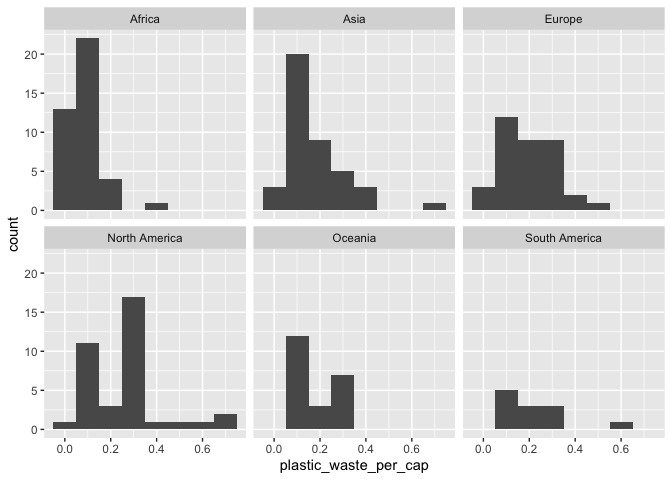
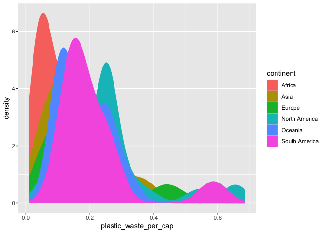
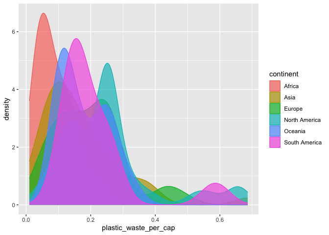
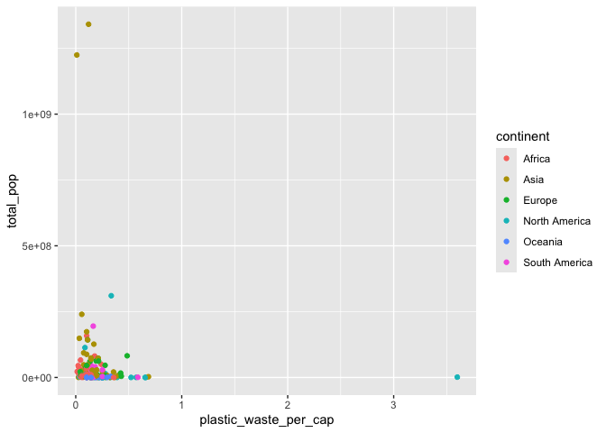
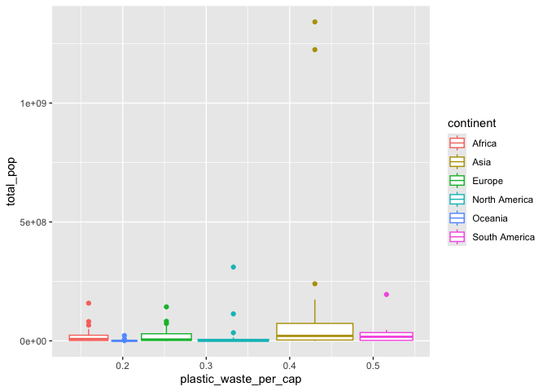
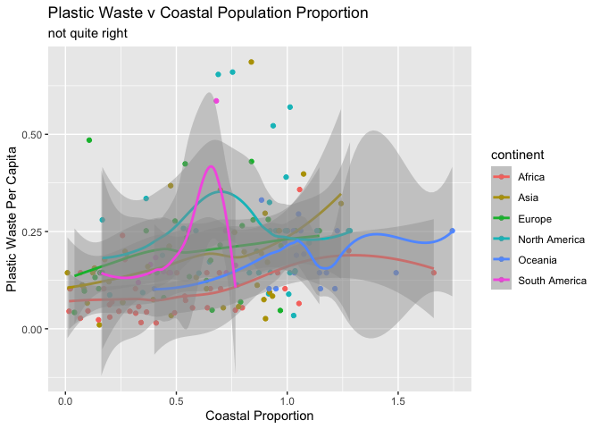

Lab 02 - Plastic waste
================
Cailey Fay
10.6.25

## Load packages and data

``` r
library(tidyverse) 
```

``` r
plastic_waste <- read.csv("data/plastic-waste.csv")
```

## Exercises

Warm up: Top left pane is for scripts / syntax / markdown files. Bottom
left is the console where you can punch in commands and R spits stuff
out. Top right pane is the environment, lets you see what data files are
in operation, and under the git tab you can make your way to committing
changes. Bottom right pane is where you can see plots, info on how to
use a particular function or package, and for accessing files.

There are 240 observations in the plastic waste dataset.

### Exercise 1

To get the distribution of plastic waste per capita:

``` r
#plain old histogram of plastic waste per capita 
ggplot(data = plastic_waste, aes(x = plastic_waste_per_cap)) +
  geom_histogram(binwidth = 0.2)
```

    ## Warning: Removed 51 rows containing non-finite outside the scale range
    ## (`stat_bin()`).

<!-- -->

To see the countries where it is \> 3.5 kg/person:

``` r
plastic_waste%>%
  filter(plastic_waste_per_cap > 3.5) 
```

    ##   code              entity     continent year gdp_per_cap plastic_waste_per_cap
    ## 1  TTO Trinidad and Tobago North America 2010    31260.91                   3.6
    ##   mismanaged_plastic_waste_per_cap mismanaged_plastic_waste coastal_pop
    ## 1                             0.19                    94066     1358433
    ##   total_pop
    ## 1   1341465

``` r
#creating the df that filters out the outliers 

df_filtered <- plastic_waste %>%
  filter(plastic_waste_per_cap < 3.5)
```

1.1 Plotting the distribution of plastic waste per capita faceted by
continent.

``` r
  ggplot(data = df_filtered, 
         aes(x=plastic_waste_per_cap)) +
 geom_histogram(binwidth = .1) +
facet_wrap(~continent)
```

<!-- --> Conclusion:
African and Asian counties are positively skewed, and tend to have lower
plastic waste per cap than North America and Europe. Less can be said
about Oceania and South America, since there are low frequencies / not a
lot of countries with data points.

With density plots

``` r
ggplot(data = df_filtered, 
       aes(x=plastic_waste_per_cap)) + 
  geom_density()
```

<!-- -->

``` r
#getting fancier 
ggplot(data=df_filtered, 
       mapping = aes(x=plastic_waste_per_cap, 
                     color = continent)) + 
  geom_density()
```

<!-- -->

``` r
#even fancier 
ggplot(data=df_filtered,
       mapping = aes(x=plastic_waste_per_cap, 
                     color = continent, 
                     fill = continent)) + geom_density()
```

<!-- -->

``` r
#Better but not quite there yet 
ggplot(data=df_filtered, 
       mapping = aes(
         x=plastic_waste_per_cap, 
         color = continent, 
         fill = continent)) + 
  geom_density(alpha=0.7)
```

<!-- -->

### Exercise 2

2.1 Recreating the plots with lower alpha

``` r
ggplot(data=df_filtered,
       mapping = aes(
         x=plastic_waste_per_cap, 
         color = continent, fill = continent)) + 
  geom_density(alpha=.2)
```

<!-- --> Nicer
to look at.

2.2 Color and fill are aesthetics because

### Exercise 3

Remove this text, and add your answer for Exercise 3 here.

``` r
ggplot(
  data = df_filtered,
  mapping = aes(
    x = continent,
    y = plastic_waste_per_cap
  )
) +
  geom_boxplot()
```

<!-- -->

``` r
geom_violin(
  mapping = NULL,
  data = NULL,
  stat = "ydensity",
  position = "dodge",
  trim = TRUE,
  bounds = c(-Inf, Inf),
  quantile.colour = NULL,
  quantile.color = NULL,
  quantile.linetype = 0L,
  quantile.linewidth = NULL,
  scale = "area",
  na.rm = FALSE,
  orientation = NA,
  show.legend = NA,
  inherit.aes = TRUE
)
```

    ## geom_violin: na.rm = FALSE, orientation = NA, quantile_gp = list(colour = NULL, linetype = 0, linewidth = NULL)
    ## stat_ydensity: trim = TRUE, scale = area, na.rm = FALSE, orientation = NA, bounds = c(-Inf, Inf)
    ## position_dodge

``` r
stat_ydensity(
  mapping = NULL,
  data = NULL,
  geom = "violin",
  position = "dodge",
  orientation = NA,
  bw = "nrd0",
  adjust = 1,
  kernel = "gaussian",
  trim = TRUE,
  scale = "area",
  drop = TRUE,
  bounds = c(-Inf, Inf),
  quantiles = c(0.25, 0.5, 0.75),
  na.rm = FALSE,
  show.legend = NA,
  inherit.aes = TRUE
)
```

    ## geom_violin: na.rm = FALSE, orientation = NA
    ## stat_ydensity: na.rm = FALSE, orientation = NA, bw = nrd0, adjust = 1, kernel = gaussian, trim = TRUE, scale = area, drop = TRUE, bounds = c(-Inf, Inf), quantiles = c(0.25, 0.5, 0.75)
    ## position_dodge

``` r
#confused by this 
```

### Exercise 4

Remove this text, and add your answer for Exercise 4 here.

``` r
ggplot(data=df_filtered, mapping= aes(x=plastic_waste_per_cap, y=mismanaged_plastic_waste_per_cap) ) + geom_point()
```

<!-- -->

``` r
ggplot(data=df_filtered, mapping= aes(x=plastic_waste_per_cap, y=mismanaged_plastic_waste_per_cap, color=continent) ) + geom_point()
```

<!-- -->

``` r
ggplot(data=df_filtered, mapping= aes(x=plastic_waste_per_cap, y=total_pop, color=continent) ) + geom_point()
```

    ## Warning: Removed 10 rows containing missing values or values outside the scale range
    ## (`geom_point()`).

<!-- -->

``` r
ggplot(
  data = df_filtered,
  mapping = aes(
    x = plastic_waste_per_cap,
    y = total_pop, color=continent
  )
) +
  geom_boxplot()
```

    ## Warning: Removed 10 rows containing non-finite outside the scale range
    ## (`stat_boxplot()`).

<!-- -->

### Exercise 5

Remove this text, and add your answer for Exercise 5 here.

``` r
CoastalProportion <- df_filtered %>%
  mutate(CP = coastal_pop / total_pop)

ggplot(data = CoastalProportion, mapping = aes(x= CP, y=plastic_waste_per_cap, color=continent)) + geom_point() + geom_smooth() +
  labs(title= "Plastic Waste v Coastal Population Proportion",
       subtitle= "not quite right",
       x="Coastal Proportion",
       y= "Plastic Waste Per Capita")
```

    ## `geom_smooth()` using method = 'loess' and formula = 'y ~ x'

    ## Warning: Removed 10 rows containing non-finite outside the scale range
    ## (`stat_smooth()`).

    ## Warning: Removed 10 rows containing missing values or values outside the scale range
    ## (`geom_point()`).

<!-- -->
