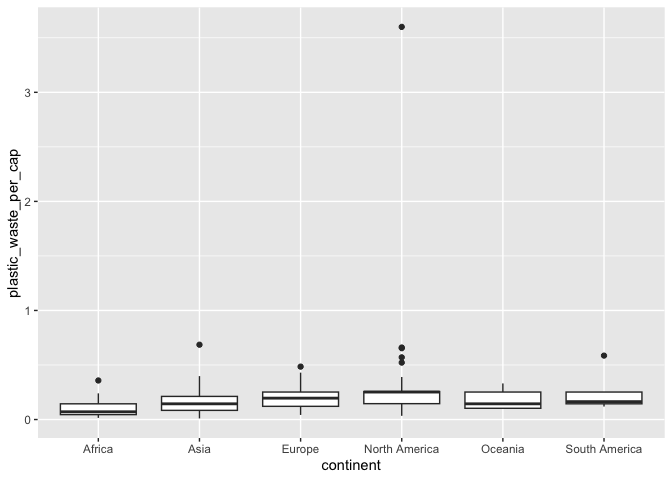

Lab 02 - Plastic waste
================
Cailey Fay
10.6.25

## Load packages and data

``` r
library(tidyverse) 
```

``` r
plastic_waste <- read.csv("data/plastic-waste.csv")
```

## Exercises

Warm up: Top left pane is for scripts / syntax / markdown files. Bottom
left is the console where you can punch in commands and R spits stuff
out. Top right pane is the environment, lets you see what data files are
in operation, and under the git tab you can make your way to committing
changes. Bottom right pane is where you can see plots, info on how to
use a particular function or package, and for accessing files.

There are 240 observations in the plastic waste dataset.

### Exercise 1

To get the distribution of plastic waste per capita:

``` r
#plain old histogram of plastic waste per capita 
ggplot(data = plastic_waste, aes(x = plastic_waste_per_cap)) +
  geom_histogram(binwidth = 0.2)
```

    ## Warning: Removed 51 rows containing non-finite outside the scale range
    ## (`stat_bin()`).

<!-- -->

To see the countries where it is \> 3.5 kg/person:

``` r
plastic_waste%>%
  filter(plastic_waste_per_cap > 3.5) 
```

    ##   code              entity     continent year gdp_per_cap plastic_waste_per_cap
    ## 1  TTO Trinidad and Tobago North America 2010    31260.91                   3.6
    ##   mismanaged_plastic_waste_per_cap mismanaged_plastic_waste coastal_pop
    ## 1                             0.19                    94066     1358433
    ##   total_pop
    ## 1   1341465

``` r
#creating the df that filters out the outliers 

df_filtered <- plastic_waste %>%
  filter(plastic_waste_per_cap < 3.5)
```

1.1 Plotting the distribution of plastic waste per capita faceted by
continent.

``` r
  ggplot(data = df_filtered, 
         aes(x=plastic_waste_per_cap)) +
 geom_histogram(binwidth = .1) +
facet_wrap(~continent)
```

<!-- --> Conclusion:
African and Asian counties are positively skewed, and tend to have lower
plastic waste per cap than North America and Europe. Less can be said
about Oceania and South America, since there are low frequencies / not a
lot of countries with data points.

With density plots

``` r
ggplot(data = df_filtered, 
       aes(x=plastic_waste_per_cap)) + 
  geom_density()
```

<!-- -->

``` r
#getting fancier 
ggplot(data=df_filtered, 
       mapping = aes(x=plastic_waste_per_cap, 
                     color = continent)) + 
  geom_density()
```

<!-- -->

``` r
#even fancier 
ggplot(data=df_filtered,
       mapping = aes(x=plastic_waste_per_cap, 
                     color = continent, 
                     fill = continent)) + geom_density()
```

<!-- -->

``` r
#Better but not quite there yet 
ggplot(data=df_filtered, 
       mapping = aes(
         x=plastic_waste_per_cap, 
         color = continent, 
         fill = continent)) + 
  geom_density(alpha=0.7)
```

<!-- -->

### Exercise 2

2.1 Recreating the plots with lower alpha

``` r
ggplot(data=df_filtered,
       mapping = aes(
         x=plastic_waste_per_cap, 
         color = continent, fill = continent)) + 
  geom_density(alpha=.2)
```

<!-- -->

2.2 Color and fill are aesthetics because

### Exercise 3

To do box plots

``` r
ggplot(
  data = plastic_waste,
  mapping = aes(
    x = continent,
    y = plastic_waste_per_cap
  )
) +
  geom_boxplot()
```

    ## Warning: Removed 51 rows containing non-finite outside the scale range
    ## (`stat_boxplot()`).

<!-- --> 3.1 Violin
plots tell us more about the shape of the distribution than box plots.
Box plots mainly show us how spread out the data is overall, and where
the median/quartiles/outliers are. While we get more of a sense of the
shape with the violin plots, we do not know where the median falls, or
other specific descriptive information.

``` r
ggplot(
  data= df_filtered, 
  mapping = aes(
    x = continent,
    y = plastic_waste_per_cap
  )
) +
  geom_violin()
```

<!-- -->

### Exercise 4

4.1 Relationship between plastic waste per capita and mismanaged plastic
waste per capita

``` r
ggplot(data=df_filtered, 
       mapping= aes(
         x=plastic_waste_per_cap, 
         y=mismanaged_plastic_waste_per_cap) ) + geom_point()
```

<!-- -->
There is somewhat of a positive relationship between plastic waste per
cap and mismanaged plastic waste per cap. As plastic waste increases,
the proportion of mismanaged plastic waste also increases, however,
there are some countries that have a lot of plastic waste but mismanage
very little of it.

4.2: European and north american countries tend to have less mismanaged
plastic waste per cap, whereas African and Asian countries appear to
mismanage plastic waste more.

``` r
ggplot(data=df_filtered, 
       mapping= aes(x=plastic_waste_per_cap, 
                    y=mismanaged_plastic_waste_per_cap, 
                    color=continent) ) + geom_point()
```

<!-- -->
4.3 Without filtering out the asian countries that have massive outlier
level total populations, there isn’t a massive difference based on
coastal vs total population. The correlation for the total pop and
plastic waste per cap is -.09, whereas it is -.12 for coastal pop and
plastic waste per cap. Therefore the coastal pop / plastic waste
relationalship is stronger.

``` r
ggplot(data=df_filtered,
       mapping= aes(
         x=plastic_waste_per_cap,
         y=total_pop, 
         color=continent) ) + geom_point()
```

    ## Warning: Removed 10 rows containing missing values or values outside the scale range
    ## (`geom_point()`).

<!-- -->

``` r
ggplot(data=df_filtered,
       mapping= aes(
         x=plastic_waste_per_cap,
         y=coastal_pop, 
         color=continent) ) + geom_point()
```

<!-- -->

``` r
cor(df_filtered$plastic_waste_per_cap, df_filtered$total_pop)
```

    ## [1] NA

``` r
cor(df_filtered$plastic_waste_per_cap, df_filtered$coastal_pop)
```

    ## [1] -0.1286294

### Exercise 5

Here is my attempt. I don’t think I picked out the right “smooth”
function, but I’ve invested as much time as I can already.

``` r
CoastalProportion <- df_filtered %>%
  mutate(CP = coastal_pop / total_pop)

ggplot(data = CoastalProportion, 
mapping = aes(x= CP, 
y=plastic_waste_per_cap, 
color=continent)) + 
geom_point() + 
   geom_smooth()
```

    ## `geom_smooth()` using method = 'loess' and formula = 'y ~ x'

    ## Warning: Removed 10 rows containing non-finite outside the scale range
    ## (`stat_smooth()`).

    ## Warning: Removed 10 rows containing missing values or values outside the scale range
    ## (`geom_point()`).

<!-- -->

``` r
  labs(title= "Plastic Waste v Coastal Population Proportion",
       subtitle= "not quite right",
       x="Coastal Proportion",
       y= "Plastic Waste Per Capita")
```

    ## <ggplot2::labels> List of 4
    ##  $ x       : chr "Coastal Proportion"
    ##  $ y       : chr "Plastic Waste Per Capita"
    ##  $ title   : chr "Plastic Waste v Coastal Population Proportion"
    ##  $ subtitle: chr "not quite right"
