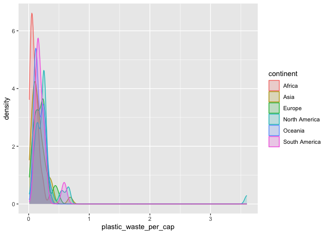

Lab 02 - Plastic waste
================
Cailey Fay
10.6.25

## Load packages and data

``` r
library(tidyverse) 
```

``` r
plastic_waste <- read.csv("data/plastic-waste.csv")
```

## Exercises

### Exercise 1

Remove this text, and add your answer for Exercise 1 here.

``` r
ggplot(data = plastic_waste, aes(x = plastic_waste_per_cap)) +
  geom_histogram(binwidth = 0.2)
```

    ## Warning: Removed 51 rows containing non-finite outside the scale range
    ## (`stat_bin()`).

<!-- -->

``` r
plastic_waste%>%
  filter(plastic_waste_per_cap > 3.5)
```

    ##   code              entity     continent year gdp_per_cap plastic_waste_per_cap
    ## 1  TTO Trinidad and Tobago North America 2010    31260.91                   3.6
    ##   mismanaged_plastic_waste_per_cap mismanaged_plastic_waste coastal_pop
    ## 1                             0.19                    94066     1358433
    ##   total_pop
    ## 1   1341465

``` r
ggplot(data=plastic_waste, aes(x=plastic_waste_per_cap)) + geom_density()
```

    ## Warning: Removed 51 rows containing non-finite outside the scale range
    ## (`stat_density()`).

<!-- -->

``` r
ggplot(data=plastic_waste, mapping = aes(x=plastic_waste_per_cap, color = continent)) + geom_density()
```

    ## Warning: Removed 51 rows containing non-finite outside the scale range
    ## (`stat_density()`).

<!-- -->

``` r
ggplot(data=plastic_waste, mapping = aes(x=plastic_waste_per_cap, color = continent, fill = continent)) + geom_density()
```

    ## Warning: Removed 51 rows containing non-finite outside the scale range
    ## (`stat_density()`).

<!-- -->

``` r
ggplot(data=plastic_waste, mapping = aes(x=plastic_waste_per_cap, color = continent, fill = continent)) + geom_density(alpha=0.7)
```

    ## Warning: Removed 51 rows containing non-finite outside the scale range
    ## (`stat_density()`).

<!-- -->

### Exercise 2

``` r
ggplot(data=plastic_waste, mapping = aes(x=plastic_waste_per_cap, color = continent, fill = continent)) + geom_density(alpha=.2)
```

    ## Warning: Removed 51 rows containing non-finite outside the scale range
    ## (`stat_density()`).

<!-- -->

``` r
#not sure why alpha is a characteristic of the plotting geom but color and fill are aesthetics. 
```

### Exercise 3

Remove this text, and add your answer for Exercise 3 here.

``` r
ggplot(
  data = plastic_waste,
  mapping = aes(
    x = continent,
    y = plastic_waste_per_cap
  )
) +
  geom_boxplot()
```

    ## Warning: Removed 51 rows containing non-finite outside the scale range
    ## (`stat_boxplot()`).

<!-- -->

``` r
geom_violin(
  mapping = NULL,
  data = NULL,
  stat = "ydensity",
  position = "dodge",
  trim = TRUE,
  bounds = c(-Inf, Inf),
  quantile.colour = NULL,
  quantile.color = NULL,
  quantile.linetype = 0L,
  quantile.linewidth = NULL,
  scale = "area",
  na.rm = FALSE,
  orientation = NA,
  show.legend = NA,
  inherit.aes = TRUE
)
```

    ## geom_violin: na.rm = FALSE, orientation = NA, quantile_gp = list(colour = NULL, linetype = 0, linewidth = NULL)
    ## stat_ydensity: trim = TRUE, scale = area, na.rm = FALSE, orientation = NA, bounds = c(-Inf, Inf)
    ## position_dodge

``` r
stat_ydensity(
  mapping = NULL,
  data = NULL,
  geom = "violin",
  position = "dodge",
  orientation = NA,
  bw = "nrd0",
  adjust = 1,
  kernel = "gaussian",
  trim = TRUE,
  scale = "area",
  drop = TRUE,
  bounds = c(-Inf, Inf),
  quantiles = c(0.25, 0.5, 0.75),
  na.rm = FALSE,
  show.legend = NA,
  inherit.aes = TRUE
)
```

    ## geom_violin: na.rm = FALSE, orientation = NA
    ## stat_ydensity: na.rm = FALSE, orientation = NA, bw = nrd0, adjust = 1, kernel = gaussian, trim = TRUE, scale = area, drop = TRUE, bounds = c(-Inf, Inf), quantiles = c(0.25, 0.5, 0.75)
    ## position_dodge

``` r
#confused by this 
```

### Exercise 4

Remove this text, and add your answer for Exercise 4 here.

``` r
ggplot(data=plastic_waste, mapping= aes(x=plastic_waste_per_cap, y=mismanaged_plastic_waste_per_cap) ) + geom_point()
```

    ## Warning: Removed 51 rows containing missing values or values outside the scale range
    ## (`geom_point()`).

<!-- -->

``` r
ggplot(data=plastic_waste, mapping= aes(x=plastic_waste_per_cap, y=mismanaged_plastic_waste_per_cap, color=continent) ) + geom_point()
```

    ## Warning: Removed 51 rows containing missing values or values outside the scale range
    ## (`geom_point()`).

<!-- -->

``` r
ggplot(data=plastic_waste, mapping= aes(x=plastic_waste_per_cap, y=total_pop, color=continent) ) + geom_point()
```

    ## Warning: Removed 61 rows containing missing values or values outside the scale range
    ## (`geom_point()`).

<!-- -->

``` r
ggplot(
  data = plastic_waste,
  mapping = aes(
    x = plastic_waste_per_cap,
    y = total_pop, color=continent
  )
) +
  geom_boxplot()
```

    ## Warning: Removed 51 rows containing missing values or values outside the scale range
    ## (`stat_boxplot()`).

    ## Warning: Removed 10 rows containing non-finite outside the scale range
    ## (`stat_boxplot()`).

<!-- -->

``` r
# insert code here
```

``` r
# insert code here
```

``` r
# insert code here
```

### Exercise 5

Remove this text, and add your answer for Exercise 5 here.

``` r
# insert code here
```
